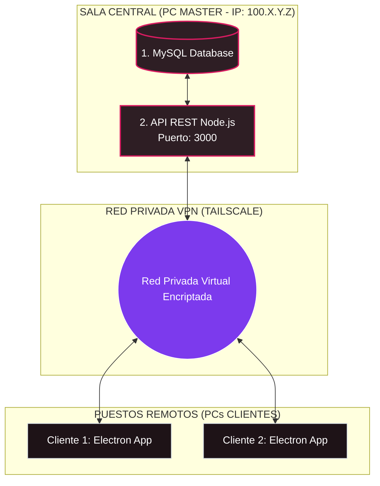

# Guía Visual de Instalación y Conexión mediante VPN (Tailscale)

Esta guía explica de manera visual y paso a paso cómo conectar los **PCs Clientes** al **PC Master** a través de una red VPN segura y privada utilizando **Tailscale**.

---

## 1. Esquema de Conexión (Con Tailscale)

Todos los computadores se unen a una red privada encriptada. La base de datos MySQL en el Master queda protegida de internet pública, y las terminales cliente consumen los datos a través de la IP de la VPN.



---

## 2. Configuración en el PC MASTER (Servidor)

El PC Master actúa como el almacén de datos del negocio. Debe estar encendido y con sesión activa en la VPN.

```
+-------------------------------------------------------------+
|                     PASO 1: INSTALAR TAILSCALE              |
|  1. Crea una cuenta en tailscale.com                        |
|  2. Descarga e instala Tailscale en el PC Master.           |
|  3. Inicia sesión.                                          |
|  4. Copia la IP asignada al Master (ej: 100.75.80.99)       |
+-------------------------------------------------------------+
                               |
                               v
+-------------------------------------------------------------+
|                     PASO 2: BASE DE DATOS                   |
|  Instala MySQL o MariaDB Server en el PC Master.            |
|  Crea una base de datos llamada: "sistema_pedidos"          |
+-------------------------------------------------------------+
                               |
                               v
+-------------------------------------------------------------+
|                      PASO 3: LA API REST                    |
|  Abre la terminal en la carpeta "api" del proyecto y corre: |
|  1. npm install (Instalar dependencias)                     |
|  2. npx prisma db push (Estructurar tablas automáticamente) |
|  3. npm run dev (Iniciar el servidor de datos en puerto 3000)|
+-------------------------------------------------------------+
```

---

## 3. Configuración en los PCs CLIENTES

Los puestos de trabajo operan desde la VPN para enviar y recibir datos en tiempo real.

```
+-------------------------------------------------------------+
|                     PASO 1: UNIRSE A LA VPN                 |
|  1. Instala Tailscale en la computadora del cliente.        |
|  2. Inicia sesión con la misma cuenta del PC Master.        |
|  3. Verifica en el panel que el PC Master figure "Conectado"|
+-------------------------------------------------------------+
                               |
                               v
+-------------------------------------------------------------+
|                     PASO 2: INSTALAR APP                    |
|  1. Copia el instalador "desktop Setup 1.0.0.exe".          |
|  2. Ejecútalo para instalar la aplicación de pedidos.       |
+-------------------------------------------------------------+
                               |
                               v
+-------------------------------------------------------------+
|                     PASO 3: CONECTAR LA APP                 |
|  1. En la esquina inferior izquierda, haz clic en:          |
|     ⚙️ Conexión                                             |
|  2. Ingresa la IP de Tailscale del Master en el formato:    |
|     http://[IP_DEL_MASTER]:3000/api                         |
|     (Ej: http://100.75.80.99:3000/api)                      |
|  3. Haz clic en [ Ok ]                                      |
+-------------------------------------------------------------+
```

---

## 4. Tabla de Diagnóstico de Errores Comunes

| Síntoma | Posible Causa | Solución |
| :--- | :--- | :--- |
| **"Error al conectar con la API"** en los clientes. | Tailscale está apagado en alguno de los equipos. | Asegúrate de que el icono de Tailscale en la barra de tareas de Windows (esquina inferior derecha) esté activo y en verde en ambos PCs. |
| **No se conecta a pesar de que la IP es correcta.** | El Firewall de Windows del Master bloquea el puerto 3000. | En el PC Master, ve a "Firewall de Windows", crea una Regla de Entrada y permite el acceso al puerto local `3000` (Protocolo TCP). |
| **La app de los clientes se desconecta intermitentemente.** | El PC Master entró en suspensión o ahorro de energía. | Configura el PC Master en "Configuración de energía" de Windows para que la pantalla se apague pero el computador **nunca entre en suspensión/dormir**. |
